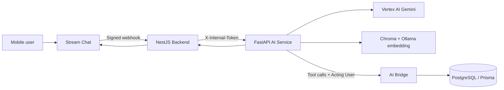

# Báo cáo hiện trạng AI Module

> Ngày rà soát: 16/07/2026  
> Phạm vi: `AI/`, `Be/src/module/chatbot/`, `Be/src/module/ai-bridge/`, cấu hình triển khai ở root và luồng Stream Chat.  
> Lưu ý: báo cáo không đọc hoặc xác nhận giá trị secret trong các file `.env`.

## 1. Kết luận điều hành

AI Module đang có nền kiến trúc tốt cho một hệ thống trợ lý y tế và đặt lịch:

- LLM được tách khỏi backend nghiệp vụ.
- Tool trả dữ liệu thay vì tự tạo câu trả lời nghiệp vụ.
- Dữ liệu cá nhân được khóa theo user ở backend.
- Đặt và hủy lịch có bước xác nhận deterministic.
- Session, lịch sử hội thoại và trạng thái agent đã có lớp lưu PostgreSQL.
- Vertex AI Gemini đã có provider hỗ trợ tool calling và streaming.

Tuy nhiên, hệ thống hiện phù hợp với demo hoặc kiểm thử nội bộ hơn là production. Các blocker chính là:

1. Cấu hình deploy hiện tại chưa chạy được AI Python service theo cách production.
2. RAG phụ thuộc Ollama local và Chroma index không được tạo tự động khi deploy.
3. Backend chưa enforce đầy đủ invariant đặt lịch và còn race condition khi confirm đồng thời.
4. Evaluation mới dừng ở unit test; chưa đo retrieval, groundedness, tool accuracy hoặc safety.
5. Guardrails, observability, privacy và distributed state mới hoạt động một phần.

### Mức độ sẵn sàng

| Hạng mục | Trạng thái | Nhận định |
|---|---|---|
| Kiến trúc AI ↔ Backend ↔ Stream Chat | Tốt | Boundary rõ, ownership được kiểm tra nhiều lớp |
| Vertex AI provider | Có điều kiện | Code đã có; chưa có E2E thật với credential và DigitalOcean |
| Tool calling | Khá | Có schema/state/validation; còn lỗi contract và invariant |
| RAG runtime | Chưa sẵn sàng | Phụ thuộc Ollama localhost, index không đi cùng deployment |
| Retrieval quality | Chưa xác định | Không có benchmark hoặc golden dataset |
| Evaluation | Chưa có | Unit test không thay thế LLM/RAG evaluation |
| Guardrails | Một phần | Có pre/post filter nhưng coverage và telemetry còn thiếu |
| Security | Một phần | Ownership tốt; secret mặc định, rate limit và privacy còn thiếu |
| Caching/state/memory | Một phần | Có persistence; cache RAM và concurrency chưa phù hợp multi-instance |
| Production deployment | Chưa đạt | Docker/runtime chưa đóng gói Python AI service đúng chuẩn |

## 2. Kiến trúc hiện tại

Các entry point chính:

- AI HTTP service: `AI/app/main.py`, `AI/app/api/chat.py`.
- Agent loop: `AI/app/agents/scheduling_agent.py`.
- Vertex provider: `AI/app/providers/gemini_provider.py`.
- Tool registry: `AI/app/tools/registry.py`.
- RAG: `AI/app/rag/indexer.py`, `AI/app/rag/retriever.py`.
- Session store: `AI/app/session/postgres_store.py`.
- DigitalOcean/Stream Chat integration: `Be/src/module/chatbot/`.
- Business-data bridge: `Be/src/module/ai-bridge/`.

## 3. Những phần đã triển khai tốt

### 3.1 Boundary giữa AI và nghiệp vụ

- AI gọi HTTP bridge thay vì truy cập Prisma trong tool.
- Bridge output chủ yếu là DATA-only; model chịu trách nhiệm diễn đạt.
- `ToolRegistry` giới hạn tool theo `AgentState`.
- Input tool được validate bằng Pydantic trước khi thực thi.
- `confirm_booking` và `cancel_appointment` không được expose trực tiếp cho model.

### 3.2 Ownership và chống giả mạo user

- `HttpBridgeClient` pin `X-Acting-User-Id` từ session đã được backend xác thực.
- Backend từ chối truy cập chéo user ở patient, history, appointment và draft.
- Chatbot controller lấy user ID từ JWT, không tin `dto.userId`.
- Stream webhook kiểm tra chữ ký raw body và ownership của `ai-consult-{userId}`.

### 3.3 Luồng xác nhận an toàn

- Agent phân loại confirm/reject bằng code thay vì giao quyết định cho LLM.
- Draft có TTL 10 phút.
- Có idempotency key cho create/confirm draft.
- Confirm/cancel button được chuyển thành input deterministic (`vâng`/`không`).
- Backend kiểm tra draft thuộc patient profile do đúng user quản lý.

### 3.4 State và conversational memory

- `SessionState` lưu booking requirement, last offered, draft và pending confirmation.
- `AiSession` dùng version để phát hiện update xung đột.
- PostgreSQL store dùng row lock khi update session.
- `AiTurn` lưu user message, AI message, model và latency.
- N lượt gần nhất được đưa lại vào prompt để tạo short-term memory.
- Patient summary được cache trong session để giảm số lần gọi bridge.

## 4. Phát hiện cần xử lý

## 4.1 P0 — Blocker trước production

### P0.1 Deployment chưa đóng gói AI service

Root `Dockerfile` dùng Node image nhưng không cài Python hoặc `AI/requirements.txt`. Trong khi đó `AI/start.js` yêu cầu `.venv/bin/python`, dùng `--reload`, hard-code port `8088` và hard-code Ollama localhost.

Hệ quả:

- Root image không thể được xem là production image hoàn chỉnh cho AI.
- AI service chưa có process lifecycle độc lập, readiness check và resource limit riêng.
- Nếu backend và AI là hai DigitalOcean component, repo chưa có manifest thể hiện cấu hình đó.

### P0.2 RAG không tự hoạt động trên fresh deployment

- Chat có thể dùng Vertex nhưng embedding luôn dùng `OllamaProvider`.
- Default Ollama URL là `127.0.0.1:11434`.
- Chroma index nằm ở `AI/data/chroma/` và bị gitignore.
- Startup FastAPI không rebuild hoặc validate index.
- Retriever dùng `get_or_create_collection`, nên có thể tạo collection rỗng mà health endpoint vẫn báo `ok`.

Với cấu hình này, câu hỏi sức khỏe bắt buộc gọi `search_knowledge`, nhưng fresh deployment có thể lỗi embedding hoặc trả knowledge rỗng.

### P0.3 Secret mặc định không an toàn

- AI default `internal_shared_secret = "changeme"`.
- Backend default `AI_INTERNAL_TOKEN = "changeme"`.
- `.dockerignore` không loại toàn bộ `.env`; local Docker build có nguy cơ đóng secret vào image.

Nếu `.env` chưa cập nhật, internal endpoints không được coi là đã bảo vệ an toàn.

### P0.4 Invariant đặt lịch chưa được enforce ở backend

`createBookingDraft` chưa xác minh đầy đủ:

- Doctor có cung cấp service đã chọn hay không.
- Start time có nằm trong lịch làm việc/override của doctor hay không.
- Slot có ở tương lai và đúng timezone hay không.
- Slot có tuân theo step/duration của hệ thống hay không.
- Conflict có phải điều kiện chặn tạo draft hay chỉ là dữ liệu trả về.

LLM có thể gọi tool với giá trị hợp lệ về schema nhưng sai nghiệp vụ. Prompt không thể thay thế validation ở backend.

### P0.5 Race condition khi confirm booking

Luồng hiện tại là:

1. Đọc draft.
2. Tìm appointment conflict.
3. Tạo appointment.
4. Update draft thành confirmed.

Các bước này không nằm trong một transaction có lock phù hợp. Hai confirm đồng thời có thể cùng nhìn thấy slot trống và tạo appointment trùng nhau. Hai draft khác nhau cho cùng doctor/time cũng có rủi ro tương tự.

## 4.2 P1 — Độ đúng của tool và state

### P1.1 `search_services` bỏ qua `clinicId`

Contract AI và controller đều nhận `clinicId`, nhưng `AiBridgeService.searchServices` chỉ filter theo tên service. Kết quả có thể bị AI diễn đạt nhầm thành “dịch vụ tại cơ sở X” trong khi dữ liệu là toàn hệ thống.

### P1.2 Hai bộ tool cùng tồn tại

Backend còn bộ tool cũ trong `Be/src/module/chatbot/tools/` và bộ bridge mới trong `Be/src/module/ai-bridge/`.

- Tool cũ có output hội thoại, fuzzy search và timezone logic riêng.
- Tool mới có DATA-only contract cho AI Python.
- Một số direct endpoints vẫn sử dụng tool cũ.

Hai bộ tool hiện không cùng được feed cho Gemini nên chưa conflict trực tiếp trong agent loop, nhưng là hai nguồn sự thật dễ drift.

### P1.3 Concurrency chỉ được phát hiện sau side effect

`_run_turn` đọc state, chạy LLM và tool, sau đó mới `store.update`. Optimistic lock có thể trả `409`, nhưng tool hoặc stream partial response có thể đã chạy trước khi conflict được phát hiện.

### P1.4 Session cache không phù hợp multi-instance

`AiPlatformClient.sessionByChannel` là `Map` trong RAM:

- Không shared giữa nhiều backend replica.
- Không có TTL.
- Có thể bypass `session_reconnect_max_age_minutes` nếu key vẫn nằm trong Map.
- Hai cache miss đồng thời có thể cùng tạo/reconnect session.

Database fallback theo `channelId` là hướng đúng, nhưng chưa có unique constraint bảo đảm chỉ một session mở trên một channel.

## 4.3 P1 — RAG và chất lượng knowledge

### Hiện trạng dữ liệu

- Kho knowledge hiện có khoảng 14 disease, 10 symptom, 1 FAQ và 1 policy.
- README cũ mô tả index 7 file/25 chunks, không còn khớp số tài liệu hiện tại.
- `_meta/sources.md` xác nhận nội dung là seed V1 cho demo, chưa có nguồn lâm sàng cụ thể.

### Retrieval hiện tại

- Dense retrieval bằng `bge-m3`.
- Chroma cosine distance.
- `top_k=5`, `min_score=0.45` cố định.
- Có filter theo knowledge type và disease allowlist.

### Những phần còn thiếu

- Không có keyword/BM25 hoặc hybrid retrieval.
- Không có reranker.
- Không có query rewriting/synonym normalization có kiểm thử.
- Không có citation/source ID trong câu trả lời cuối.
- Không có document version manifest hoặc index checksum.
- Không có benchmark chứng minh threshold `0.45` phù hợp tiếng Việt và knowledge hiện tại.

Kết luận: pipeline retrieval đã tồn tại, nhưng retrieval quality chưa được đánh giá.

## 4.4 P1 — Evaluation và observability

### Đã có

- Unit test cho state, resolver ngày giờ, confirm intent, policy và agent fake.
- Trace ID theo lượt.
- Lưu latency, model và tool result summary trong `AiTurn`.
- JSON logging tối thiểu.

### Chưa có

- Golden dataset query → expected document/tool/action.
- Recall@K, Hit@K, MRR hoặc nDCG.
- Groundedness/faithfulness/hallucination evaluation.
- Tool-selection và argument accuracy.
- End-to-end test Vertex → AI → bridge → database → Stream Chat.
- Load test, duplicate webhook test và concurrent confirm test.
- Token/cost dashboard.
- Error-rate, retrieval-empty-rate, tool-error-rate và safety-trigger dashboard.

Các field `AiTurn.toolCalls` và `policyViolations` đã có trong schema nhưng chưa được ghi đầy đủ từ agent runtime.

## 4.5 P1 — Guardrails và security

### Đã có

- Pre-filter self-harm/emergency.
- Emergency detector dựa trên symptom metadata.
- Post-validator chẩn đoán, code fence và một số dấu hiệu leak.
- Disease allowlist/blocklist.
- Ownership ở backend thay vì dựa vào prompt.
- Internal token và Stream webhook signature.

### Chưa hoàn chỉnh

- `injection_suspected` được tính nhưng không được log hoặc thay đổi policy xử lý.
- `sensitive-topics` và các few-shot được load vào registry nhưng không được append vào system prompt runtime.
- Không giới hạn độ dài message.
- Không rate limit/quota theo user hoặc channel.
- Không có circuit breaker/cost ceiling cho Vertex.
- Gemini payload chưa cấu hình safety settings rõ ràng.
- Post-validator chỉ dùng pattern đơn giản, dễ false positive/false negative.
- Không có security regression suite cho prompt injection, data exfiltration và cross-user access.

## 4.6 P1 — Privacy và memory

- Full user message và AI message được lưu trong `AiTurn`.
- N lượt gần nhất được gửi lên Vertex ở mỗi turn.
- Patient name, age, gender và last visit được đưa vào system prompt.
- Khi user hỏi lịch sử khám, phần chẩn đoán/đơn thuốc có thể xuất hiện trong AI response và tiếp tục nằm trong recent history.

Chưa thấy policy/code cho:

- Consent sử dụng LLM cloud.
- Retention và xóa hội thoại.
- PII/PHI redaction.
- Export/delete theo user.
- Phân quyền audit data.
- Phân loại dữ liệu nào được phép gửi Vertex.

## 5. Kết quả kiểm chứng trong workspace

| Kiểm tra | Kết quả |
|---|---|
| `python3 -m compileall -q AI/app` | Pass |
| `python3 -m pytest -q` trong `AI/` | Không chạy được vì môi trường chưa cài `pytest` |
| `npm run build` trong `Be/` | Fail 7 lỗi |
| Lỗi backend build | Thiếu `@prisma/adapter-pg` trong install hiện tại và Prisma client chưa expose `bookingDraft` |
| Prisma schema | Có `BookingDraft`, `AiSession`, `AiTurn` |
| Git worktree trước khi tạo báo cáo | Clean |

Lỗi backend có thể liên quan dependency install/Prisma generate cũ trong workspace, nhưng cho tới khi clean install, generate và build pass thì chưa thể coi pipeline deploy là reproducible.

## 6. Kết luận theo câu hỏi “đã hoạt động chưa?”

- Vertex provider: đã triển khai trong code; chưa được chứng minh E2E bằng credential thật.
- Tool query: phần lớn contract hợp lý; chưa đạt production do `clinicId`, invariant và concurrency.
- RAG: đã wire; chưa bảo đảm chạy trên DigitalOcean và chưa đo chất lượng.
- Evaluation: chưa có evaluation framework thực tế.
- Retrieval quality: chưa xác định.
- Guardian/guardrails: hoạt động một phần.
- Security: ownership tốt, nhưng secret/rate limit/privacy chưa đạt.
- Caching: có cache cục bộ; chưa phù hợp scale nhiều instance.
- State: đã persist và có optimistic lock; side-effect concurrency chưa an toàn.
- Memory: short-term memory đã hoạt động ở mức code; cần bổ sung privacy và retention.

## 7. Tài liệu liên quan

- Hướng giải quyết và tiêu chí nghiệm thu: [AI_MODULE_REMEDIATION_PLAN.md](./AI_MODULE_REMEDIATION_PLAN.md)
- Tài liệu AI hiện có: `AI/README.md`, `AI/docs/`.

